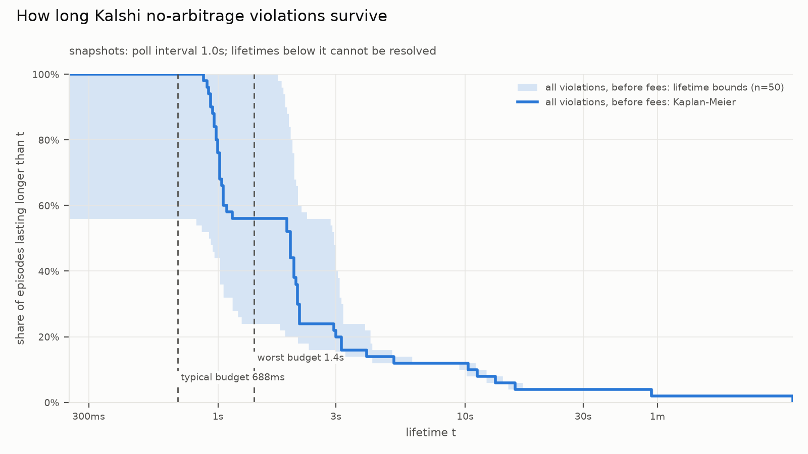
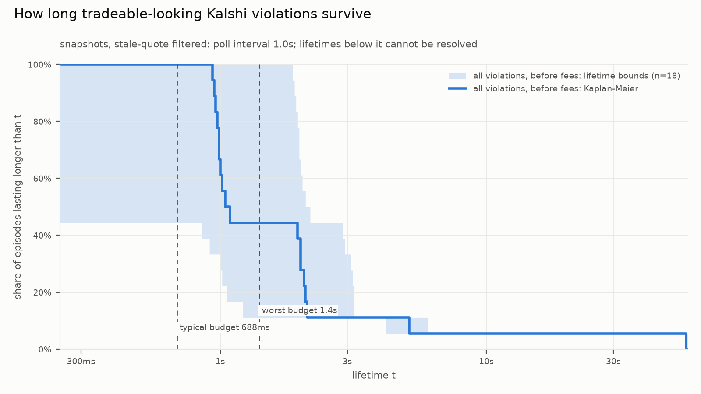
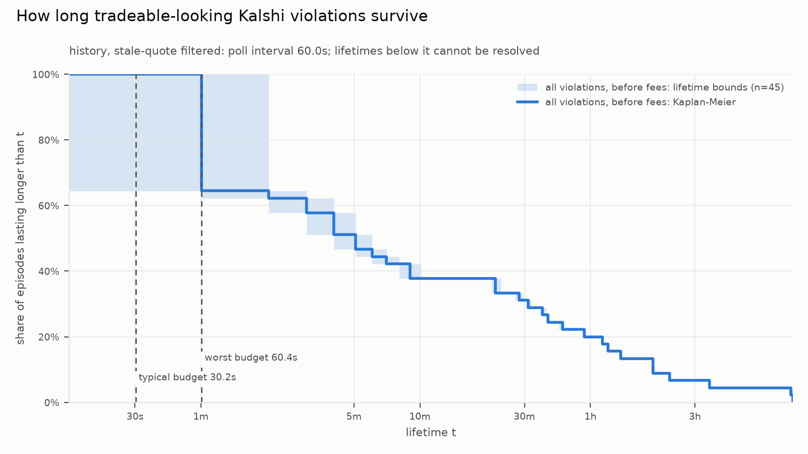

# Do No-Arbitrage Violations on Kalshi Survive Fees and Latency?

**Detection, lifetimes and execution replay on a regulated prediction market**

Danylo Ryzhokhin · September 2026

---

## Abstract

Prices of binary event contracts must be consistent with a probability measure: a contract on "X above 4.00%" cannot be worth more than one on "X above 3.75%", and mutually exclusive outcomes cannot be sold for more than the one dollar they jointly pay. This study records full order books for about 300 Kalshi markets once per second, detects every executable violation of these constraints, charges each one Kalshi's fee schedule at the size the book actually offered, and measures how long each violation stays visible. The detect-to-order reaction time of a retail-grade setup is measured component by component without placing an order, and an execution replay sends simulated immediate-or-cancel orders on every leg against the next recorded book. Lifetimes are estimated as censored intervals with Kaplan–Meier, and uncertainty is reported with a bootstrap that resamples whole events. A second dataset of seven days of one-minute candles gives weekday coverage at coarser resolution. The central finding is the gap between violations that exist before fees and violations that could have been captured after fees, depth, reaction time and leg risk; the numbers are in Section 11.

---

## 1. Introduction

Prediction markets list many contracts whose payoffs are logically linked. Kalshi, a CFTC-regulated exchange, lists threshold ladders ("Fed funds rate above K after the September meeting" for several K), bucketed outcome sets ("S&P 500 close in range i"), and mutually exclusive event sets (the winner of a game). Prediction-market prices are widely read as probabilities (Wolfers and Zitzewitz, 2004). Because these links are logical rather than statistical, a price that breaks one is not a judgement call: it is either an arbitrage or an artefact of how the price was observed.

Three frictions separate an observed violation from a profitable trade:

1. **Fees.** Kalshi charges a fee proportional to $P(1-P)$ per contract, rounded up per order. Small edges near 50¢ disappear.
2. **Depth.** A 3¢ edge available on 0.07 contracts is not a trade.
3. **Time.** A violation must still be there when the orders arrive, and every leg must fill; otherwise the position is directional, not hedged.

The contribution is a measurement pipeline that charges all three honestly and reports the result with the uncertainty the data supports:

- a single dominance condition that covers every detector, with exact fee accounting walked through book depth;
- lifetime estimation that treats polling-limited observations as intervals and handles censoring;
- a reaction-time budget measured part by part, and a catch probability that integrates the survival curve over that distribution;
- an execution replay with explicit leg-risk accounting;
- robustness checks: a liquidity filter, threshold sensitivity, and a cluster bootstrap.

The same code runs offline (`mispricing.report`) and live behind a monitoring dashboard (`dashboard/`), and tests verify that both paths produce identical episodes.

## 2. Market structure

A Kalshi market is a binary contract. YES pays \$1 if the event occurs and \$0 otherwise; NO pays the complement. One YES and one NO together always pay exactly \$1, so a pair is fully collateralised by \$1.

The order book API returns **bids only**, for both sides, in ascending price order. A NO bid at $q$ is an offer to fund the NO half of a pair for $q$; matching it against a YES buyer at $1-q$ creates the pair. Hence

$$\text{ask}_{\text{YES}} = 1 - \text{bid}_{\text{NO}}, \qquad \text{ask}_{\text{NO}} = 1 - \text{bid}_{\text{YES}}.$$

This identity is mechanical: it holds whatever anyone believes about the event. Prices are decimal dollars with sub-cent ticks on some markets, and sizes can be fractional.

## 3. No-arbitrage constraints

**Proposition 1 (basket dominance).** Let a basket hold one unit of contracts $c_1,\dots,c_k$ whose total payoff is at least $W$ in every state of the world. If the basket can be bought at asks $a_1,\dots,a_k$ with fees $f$ such that $\sum_i a_i + f < W$, buying it earns at least $W - \sum_i a_i - f > 0$ in every state.

The proof is immediate from the payoff bound. All detectors are instances, and every leg is a taker buy (selling YES at the bid is buying NO at one minus the bid). This is the discrete form of the fundamental theorem of asset pricing: absent arbitrage, prices are expectations under some probability measure (Harrison and Pliska, 1981), so they must respect set inclusion and additivity.

### 3.1 YES/NO cross

Buying YES and NO pays exactly \$1. A violation needs $\text{ask}_{\text{YES}} + \text{ask}_{\text{NO}} < 1$. Substituting Section 2,

$$ (1-\text{bid}_{\text{NO}}) + (1-\text{bid}_{\text{YES}}) < 1 \iff \text{bid}_{\text{YES}} > \text{ask}_{\text{YES}},$$

a crossed book, which the matching engine clears immediately. This detector therefore acts as a data-integrity check: an observation of it signals stale or misaligned data rather than an opportunity.

### 3.2 Threshold ladder

For markets "$X > K_1$" and "$X > K_2$" with $K_1 < K_2$, the event $\{X > K_2\}$ is a subset of $\{X > K_1\}$, so any probability measure gives $P(X > K_2) \le P(X > K_1)$. Buy YES on the wider rung $K_1$ and NO on the narrower rung $K_2$:

| state | YES($K_1$) | NO($K_2$) | total |
|---|---|---|---|
| $X \le K_1$ | 0 | 1 | 1 |
| $K_1 < X \le K_2$ | 1 | 1 | 2 |
| $X > K_2$ | 1 | 0 | 1 |

The basket pays at least \$1, so it is an arbitrage when

$$ a_{\text{YES}}(K_1) + \big(1 - b_{\text{YES}}(K_2)\big) + f < 1 \iff b_{\text{YES}}(K_2) - a_{\text{YES}}(K_1) > f .$$

For "$X < K$" ladders the inclusion reverses and the higher strike is the wider rung. All pairs are checked, not only neighbours: with bids and asks differing, rungs 1–2 and 2–3 can both satisfy the inequality while 1–3 violates it. A running minimum of wider-rung asks screens each rung in constant time, so pairs are enumerated only when a violation is possible.

A ladder must hold one market per strike. Kalshi sports spread events list "Team A wins by more than $K$" and "Team B wins by more than $K$" under one event, and some crypto events vary the date at a fixed strike; comparing across those creates false violations, so events with duplicate strikes are excluded.

### 3.3 Mutually exclusive sets

Let $n$ markets be mutually exclusive, so at most one resolves YES.

- **Short basket.** Buy NO on all $n$. At most one NO loses, so the payoff is at least $n-1$, whether or not the listed outcomes are exhaustive. Arbitrage when $\sum_i (1-b_i) + f < n-1$, i.e. $\sum_i b_i - 1 > f$.
- **Long basket.** Buy YES on all $n$. The payoff is exactly \$1 only if the set is exhaustive. Arbitrage when $\sum_i a_i + f < 1$.

Kalshi's mutually-exclusive flag does not promise exhaustiveness, and the set of live markets changes over time: players eliminated from a tournament have their markets closed. Evaluating today's two finalists as a complete set a week before the final would be lookahead. A long basket is therefore evaluated at time $t$ only if every other market in the event had closed by $t$ and every chosen market had opened.

## 4. Transaction costs

Kalshi's schedule (July 2026 update) sets the taker fee on an order of $C$ contracts at price $P$ to

$$ f_{\text{taker}} = \left\lceil 0.07 \cdot m \cdot C \cdot P(1-P) \right\rceil_{\$0.01}, $$

with maker fees at a share $s \in \{0, 0.25, 0.5\}$ of the taker rate depending on the series' fee type, and a series multiplier $m$ (1 for most series, 0.5 for some sports). Both $m$ and the fee type are read per series from the API.

$P(1-P)$ is the variance of a Bernoulli payoff and also the expected gain $(1-P)\cdot P$ of a buyer at a fair price, so the fee is largest at 50¢ (1.75¢ per contract at $m=1$) and vanishes at the extremes. The fee is symmetric in $P$ and $1-P$, so YES and NO legs at complementary prices pay the same.

Rounding is applied once per order: each fill's fee is rounded up to \$0.000001, and an order-level accumulator rounds to the member's cent precision and rebates overpayment on later fills. The effective fee is one round-up per order. One hundred single-contract orders at 50¢ pay \$2.00; one hundred-contract order pays \$1.75. Fee arithmetic uses exact decimals: in binary floating point $0.07 \times 100 \times 0.25 = 1.7500000000000002$, which rounds up to \$1.76.

**Example.** A ladder with $a_{\text{YES}}(K_1)=0.81$ and $b_{\text{YES}}(K_2)=0.83$ has a 2¢ gross edge. On 100 baskets the legs pay $\lceil 1.0773\rceil + \lceil 0.9877\rceil = \$2.07$ in fees against \$2.00 of edge: a loss.

## 5. Detection with depth

Each leg is an ask ladder $(p_{k,1}, s_{k,1}), (p_{k,2}, s_{k,2}), \dots$ with $p_{k,j}$ increasing. Walking all legs together, the marginal gross edge on segment $j$ is

$$ \Delta_j = W - \sum_k p_{k,\,i_k(j)}, $$

where $i_k(j)$ is the level leg $k$ is on. Prices only rise, so $\Delta_j$ is non-increasing and cumulative gross P&L $G(q)$ is concave and piecewise linear in basket count $q$. The walk stops at the first $\Delta_j \le 0$, giving $q_{\max}$. Net P&L is $G(q) - \sum_k f_k(q)$ with each leg's fills charged as one order. Between breakpoints $G$ is linear and fees only step up, so the optimum lies at a breakpoint or at one basket; those candidates are evaluated exactly. An empty book side is never read as a zero price: a leg with no counterparty makes the basket unavailable.

## 6. Data

**Universe.** Events are kept whole, never market by market, since dropping a leg breaks a set. They are ranked by 24-hour volume with a per-category cap across economics, financials, commodities and sports.

**Order books.** The batch endpoint `/markets/orderbooks` accepts up to 100 tickers. Each poll cycle requests all markets in three to four calls, packing each event's markets into one call so its legs are observed at the same instant. Every response is timestamped on local receipt; round-trip time uses a monotonic clock. Only changed books are stored, and recorder restarts are separate sessions whose books are never carried across the gap.

**Candles.** For weekday coverage, one-minute candlesticks (bid/ask open, high, low, close; no sizes) are downloaded for the preceding seven days. Kalshi omits minutes without changes, so quotes are carried forward. Only closing quotes are compared across markets, because a minute's high bid and low ask on different markets need not have coexisted.

## 7. Lifetimes

A violation is observed at polls $t_s, \dots, t_e$ of its event and not at the neighbouring polls $t_{\text{prev}}$ and $t_{\text{next}}$. Its true start lies in $(t_{\text{prev}}, t_s]$ and its end in $[t_e, t_{\text{next}})$, so its lifetime $L$ satisfies

$$ t_e - t_s \;\le\; L \;\le\; t_{\text{next}} - t_{\text{prev}} . $$

A violation seen in a single one-second poll has $L \in [0, 2]$ seconds. Nothing shorter than the poll interval is resolvable, and every statistic is reported as an interval.

An episode touching the start or end of a recording session, or a polling gap longer than three intervals, lacks $t_{\text{prev}}$ or $t_{\text{next}}$ and is censored: only $L \ge t_e - t_s$ is known. Discarding censored episodes biases lifetimes down because long episodes are the most likely to be cut off. The survival function $S(t) = P(L > t)$ is estimated with Kaplan and Meier (1958):

$$ \hat S(t) = \prod_{t_i \le t} \left(1 - \frac{d_i}{n_i}\right), $$

where $d_i$ episodes end at $t_i$ and $n_i$ remain at risk just before it. Uncensored episodes enter at the midpoint of their interval; censored ones enter at their lower bound as still alive. The empirical bounds $\#\{L_{\text{lo}} > t\}/N$ and $\#\{L_{\text{hi}} > t\}/N$ are drawn around the estimate.

## 8. Reaction time

A violation that begins at time 0 can be captured only if it outlives

$$ T = D + T_{\text{fetch}} + T_{\text{compute}} + T_{\text{order}}, \qquad D \sim \mathcal{U}(0, \Delta), $$

where $\Delta$ is the poll interval. Each part is measured directly:

- **$T_{\text{fetch}}$**: warm persistent-connection GETs of a 100-ticker book batch.
- **$T_{\text{compute}}$**: quote construction plus all detectors for one batch.
- **$T_{\text{order}}$**: a POST to Kalshi's create-order endpoint with an empty body and no credentials, rejected with HTTP 401 by the exchange's authentication layer. This is a lower bound on a real order, which adds request signing, verification, risk checks and matching. No order is placed.

TCP connection time measures the round trip to the nearest CDN edge, not to the exchange; the edge-to-exchange leg appears in time-to-first-byte. The typical budget is $\Delta/2$ plus the medians, the worst case $\Delta$ plus the 95th percentiles. Since $S$ is non-linear, the catch probability integrates it over the whole reaction-time distribution rather than evaluating it at one point:

$$ \pi = \mathbb{E}\big[\hat S(T)\big] \approx \frac{1}{M} \sum_{m=1}^{M} \hat S\big(D^{(m)} + T^{(m)}_{\text{fetch}} + T^{(m)}_{\text{compute}} + T^{(m)}_{\text{order}}\big), $$

with each component resampled from its measurements. Shares of episodes outliving a fixed budget carry Wilson (1927) score intervals, which stay inside $[0,1]$ for small counts. At the speeds studied here the relevant competition is other retail and semi-professional traders, not the microsecond race analysed by Budish, Cramton and Shim (2015); the budget quantifies which part of that range this setup occupies.

## 9. Execution replay

Lifetimes say whether a violation lasted; the replay asks whether it could have been traded. When a violation first appears and is positive after fees at its best size $q^*$, the simulator places one immediate-or-cancel limit buy per leg for $q=\min(q^*, 500)$ baskets at the worst price the detection needed. The cap keeps a single deep book from dominating dollar P&L. Orders land after a reaction time $R = T_{\text{compute}} + T_{\text{order}}$ drawn from the measurements, and each leg fills independently against the first recorded book at or after $t + R$.

Fill certainty is classified by what the data can show. If every leg's book is unchanged between detection and that poll, nothing traded, and the fill at detection prices is **certain**. If a book changed, the order is filled against the new book, which is **pessimistic**, because the change may have arrived after the order.

With fills $h_k$ per leg, $h = \min_k h_k$ baskets are hedged. Excess contracts are sold immediately into that leg's bids at a second fee, and whatever no bid absorbs is written off:

$$ \text{P\&L} = W h - \sum_k \text{cost}_k - \sum_k f^{\text{buy}}_k + \sum_k \text{proceeds}_k - \sum_k f^{\text{sell}}_k . $$

Outcomes are *full* (every leg filled $q$), *partial* ($0 < h < q$), *legged* ($h = 0$ but some leg filled) and *miss*. The replay ignores queue priority and competing traders, which makes fills optimistic, and capital locked until settlement.

## 10. Robustness

**Liquidity filter.** An episode counts as tradeable only if every leg traded at least 100 contracts in the 24 hours before universe selection, at least 5 baskets sit at the best prices, and every leg's bid–ask spread is at most 10¢. Each threshold is varied one at a time to show how the headline moves.

**Clustered uncertainty.** Episodes on the same event share traders, quotes and news, so they are not independent. Resampling episodes gives intervals that are too narrow. Instead whole events are resampled with replacement, following the cluster bootstrap of Cameron, Gelbach and Miller (2008) built on Efron (1979), and percentile intervals are reported next to the naive ones. With fewer than about ten events the cluster bootstrap is itself unreliable, and the report flags this.

## 11. Results

### 11.1 Live order books

<!-- RESULTS:SNAPSHOTS:START -->
_Generated by `python -m mispricing.report --source snapshots`; full tables in [results/snapshots/results.md](../results/snapshots/results.md)._

#### Headline

Over 1.0 h of 1.0s order-book polling, I found 50 no-arbitrage violation episodes before fees across 4 events; 4 were profitable after fees at the best available size (0 after the stale-quote filter). Median lifetime was between 919ms and 2.9s. Measured reaction time is ~688ms (1.4s worst case); an estimated 89% of violations outlived it. In replay, 0 of 2 fee-positive signals filled both legs, for simulated P&L of $-2.06 ($0.00 counting only fills that were certain).

#### Data

|  |  |
|---|---|
| source | recorded order books (`data/snapshots`) |
| window | 2026-09-13 05:28 UTC → 2026-09-13 06:28 UTC |
| poll interval | 1.0s |
| markets / events watched | 298 / 21 |
| recording sessions | 1 |
| polls (batches) / failed | 14,384 / 0 (0%) |

#### Violations before and after fees

An episode is one continuous stretch during which a violation was visible. "After fees" = positive net P&L at the best size the book allowed.

| kind | episodes | positive after fees | episodes (filtered) | positive after fees (filtered) |
|---|---|---|---|---|
| yes_no_cross | 0 | 0 | 0 | 0 |
| ladder | 1 | 0 | 0 | 0 |
| set_short | 25 | 0 | 13 | 0 |
| set_long | 24 | 4 | 5 | 0 |
| **total** | 50 | 4 | 18 | 0 |

Stale-quote filter: 24h volume ≥ 100 contracts on every leg, ≥ 5 baskets at the best prices, every leg's spread ≤ 10¢.

#### Lifetimes

Lifetimes are intervals, not points: a violation seen at polls t_s..t_e lived between t_e − t_s and t_next − t_prev. Nothing shorter than the 1.0s poll can be resolved.

| group | episodes | events | median lifetime | definitely outlived typical budget | Kaplan–Meier outlived | catch probability (KM) |
|---|---|---|---|---|---|---|
| all | 50 | 4 | 919ms – 2.9s | 56% | 100% | 89% |
| stale-quote filtered | 18 | 3 | 0ms – 2.1s | 44% | 100% | 87% |
| positive after fees | 4 | 1 | 1.5s – 3.6s | 100% | 100% | 100% |
| filtered and positive after fees | 0 | 0 | – | – | – | – |




#### Latency budget

Budget: typical **688ms**, worst **1.4s** (interval/2 + p50(fetch + compute + order); worst = interval + p95 of each (latency.py)).

| component | p50 | p95 |
|---|---|---|
| detection lag (Uniform over the poll interval) | 500ms | 1.0s |
| fetch order books (warm GET, ~100 tickers) | 102ms | 201ms |
| compute (quotes + detectors, one batch) | 2ms | 4ms |
| order round trip (unauthenticated POST, rejected 401 — a lower bound) | 88ms | 197ms |
| TCP connect (RTT to the CDN edge, not the exchange) | 15ms | 95ms |

Measured 2026-09-13T03:24:54Z via CDN edge LAX54-P12. No order was ever placed.

#### Execution replay

Each new fee-positive violation becomes IOC limit buys on every leg, landing after a reaction time resampled from the latency measurements, and fills against the next recorded book. Unchanged books make a fill certain; changed books are evaluated pessimistically. Size is capped at 500 baskets per signal. Queue priority and competing traders are not modeled, which makes this optimistic.

|  | all signals | stale-quote filtered |
|---|---|---|
| signals | 2 | 0 |
| full fill rate (both legs, full size) | 0% | – |
| leg-risk incidents (one leg short) | 2 | 0 |
| P&L the detector expected | $0.12 | $0.00 |
| simulated P&L | $-2.06 | $0.00 |
| simulated P&L, certain fills only | $0.00 | $0.00 |
| contracts written off (no bid to unwind) | 0.00 | 0 |

| outcome | count |
|---|---|
| legged (book changed) | 1 |
| partial (book changed) | 1 |

#### Robustness

##### Error bars: episodes are not independent

95% bootstrap intervals on the stale-quote filtered episodes. *Naive* resamples episodes; *cluster* resamples whole events. When the cluster interval is much wider, the naive one was overconfident. **Only 3 events: with fewer than ~10 clusters the bootstrap itself is unreliable (it can even come out narrower than the naive interval); treat every interval here as indicative.**

| statistic | point | naive 95% CI | cluster 95% CI (by event) |
|---|---|---|---|
| share positive after fees (best size) | 0% | 0% – 0% | 0% – 0% |
| median lifetime, lower bound (s) | 0ms | 0ms – 1.0s | 0ms – 849ms |
| median lifetime, upper bound (s) | 2.1s | 2.0s – 3.1s | 2.1s – 2.9s |
| share definitely outliving typical budget | 44% | 22% – 67% | 33% – 60% |
<!-- RESULTS:SNAPSHOTS:END -->

### 11.2 Seven days of one-minute candles

<!-- RESULTS:HISTORY:START -->
_Generated by `python -m mispricing.report --source history`; full tables in [results/history/results.md](../results/history/results.md)._

#### Headline

Over 168.0 h of 60.0s candles, I found 77 no-arbitrage violation episodes before fees across 16 events; 4 were profitable after fees at the best available size (0 after the stale-quote filter). Median lifetime was between 4.0m and 6.0m. Candle data cannot resolve anything faster than a minute, so it says nothing about a sub-second budget.

#### Data

|  |  |
|---|---|
| source | 1-minute candles |
| window | 2026-09-06 00:10 UTC → 2026-09-13 00:09 UTC |
| poll interval | 60.0s |
| markets / events watched | 300 / 30 |
| recording sessions | 1 |
| polls (batches) / failed | 9,983 / 0 (0%) |

#### Violations before and after fees

An episode is one continuous stretch during which a violation was visible. "After fees" = positive net P&L at the best size the book allowed (history has no depth: 1 or 100 contracts assumed).

| kind | episodes | positive after fees | episodes (filtered) | positive after fees (filtered) |
|---|---|---|---|---|
| yes_no_cross | 0 | 0 | 0 | 0 |
| ladder | 41 | 4 | 10 | 0 |
| set_short | 24 | 0 | 24 | 0 |
| set_long | 12 | 0 | 11 | 0 |
| **total** | 77 | 4 | 45 | 0 |

Stale-quote filter: 24h volume ≥ 100 contracts on every leg, ≥ 5 baskets at the best prices (not applied to history), every leg's spread ≤ 10¢.

#### Lifetimes

Lifetimes are intervals, not points: a violation seen at polls t_s..t_e lived between t_e − t_s and t_next − t_prev. Nothing shorter than the 60.0s poll can be resolved.

| group | episodes | events | median lifetime | definitely outlived typical budget | Kaplan–Meier outlived | catch probability (KM) |
|---|---|---|---|---|---|---|
| all | 77 | 16 | 4.0m – 6.0m | 66% | 100% | 100% |
| stale-quote filtered | 45 | 16 | 4.0m – 6.0m | 64% | 100% | 100% |
| positive after fees | 4 | 1 | 10.5m – 12.5m | 100% | 100% | 100% |
| filtered and positive after fees | 0 | 0 | – | – | – | – |




#### Latency budget

Budget: typical **30.2s**, worst **60.4s** (interval/2 + p50(fetch + compute + order); worst = interval + p95 of each (latency.py)).

#### Robustness

##### Error bars: episodes are not independent

95% bootstrap intervals on the stale-quote filtered episodes. *Naive* resamples episodes; *cluster* resamples whole events. When the cluster interval is much wider, the naive one was overconfident.

| statistic | point | naive 95% CI | cluster 95% CI (by event) |
|---|---|---|---|
| share positive after fees (best size) | 0% | 0% – 0% | 0% – 0% |
| median lifetime, lower bound (s) | 4.0m | 60.0s – 21.0m | 0ms – 21.0m |
| median lifetime, upper bound (s) | 6.0m | 3.0m – 23.0m | 2.0m – 23.0m |
| share definitely outliving typical budget | 64% | 51% – 78% | 46% – 82% |
<!-- RESULTS:HISTORY:END -->

## 12. Discussion

The before-fee counts show that Kalshi prices do break logical constraints, most often in mutually exclusive sets during live events, where several books move quickly and independently. Fees remove most of those breaks, as Section 4 predicts: typical edges are one or two cents while a leg near the middle of the price range costs about 1.75¢ per contract.

The few violations that remain positive after fees are the least tradeable. In the recording they concentrate in fast in-play markets, with fractions of a contract at the best prices, and the liquidity filter removes them. The replay makes the mechanism concrete: by the time a simulated order lands, one leg has usually moved, leaving a partial or one-legged position whose unwind costs more than the edge.

Lifetimes are not the binding constraint on their own. Many violations outlive the measured reaction time, but a violation that persists because nobody can fill it at size is not an opportunity. The informative quantity is the joint condition: positive after fees, deep enough, still present when the orders land, and filled on every leg.

Detection lag from polling is the largest part of the reaction time. A pushed market-data feed would remove it, but it would not create depth, and depth is what fails first.

## 13. Limitations and further work

- **Observation.** Polling cannot resolve sub-second lifetimes; an authenticated WebSocket feed would give event-time data.
- **Orders.** The order round trip is a lower bound. Kalshi's demo exchange would allow measuring real acknowledgements.
- **Competition.** Queue position and other traders are not modelled. Trade prints could estimate how often a quote is taken before a late order arrives.
- **Sample.** The recording covers a weekend. Economic markets trade less then, which the weekday candle dataset only partly offsets, and results rest on the number of distinct events reported beside each statistic.
- **Stale inputs.** Twenty-four-hour volume comes from universe selection and ages over a long recording.
- **Scope.** Cross-venue comparison with Polymarket needs contract matching by resolution criteria and is left out to avoid false matches.

## References

- Cameron, A. C., Gelbach, J. B., and Miller, D. L. (2008). Bootstrap-based improvements for inference with clustered errors. *Review of Economics and Statistics*, 90(3), 414–427.
- Budish, E., Cramton, P., and Shim, J. (2015). The high-frequency trading arms race: Frequent batch auctions as a market design response. *Quarterly Journal of Economics*, 130(4), 1547–1621.
- Efron, B. (1979). Bootstrap methods: Another look at the jackknife. *Annals of Statistics*, 7(1), 1–26.
- Harrison, J. M., and Pliska, S. R. (1981). Martingales and stochastic integrals in the theory of continuous trading. *Stochastic Processes and their Applications*, 11(3), 215–260.
- Kaplan, E. L., and Meier, P. (1958). Nonparametric estimation from incomplete observations. *Journal of the American Statistical Association*, 53(282), 457–481.
- Wilson, E. B. (1927). Probable inference, the law of succession, and statistical inference. *Journal of the American Statistical Association*, 22(158), 209–212.
- Wolfers, J., and Zitzewitz, E. (2004). Prediction markets. *Journal of Economic Perspectives*, 18(2), 107–126.
- Kalshi. Fee Schedule (July 2026 update); API documentation for order books, candlesticks, series fees and fee rounding.

## Appendix: reproduction

```
pip install -e ".[dev]"
python -m pytest
python -m mispricing.universe --category Economics --category Financials --category Commodities \
       --category Sports --max-markets 300 --max-markets-per-category 100
python -m mispricing.fees --fetch
python -m mispricing.recorder --interval 1.0 --hours 16
python -m mispricing.latency
python -m mispricing.report --source snapshots
python -m mispricing.history --days 7
python -m mispricing.report --source history
python -m dashboard.server
```
